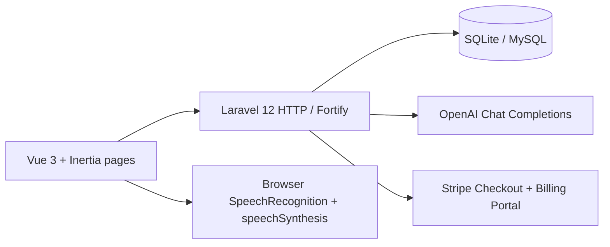
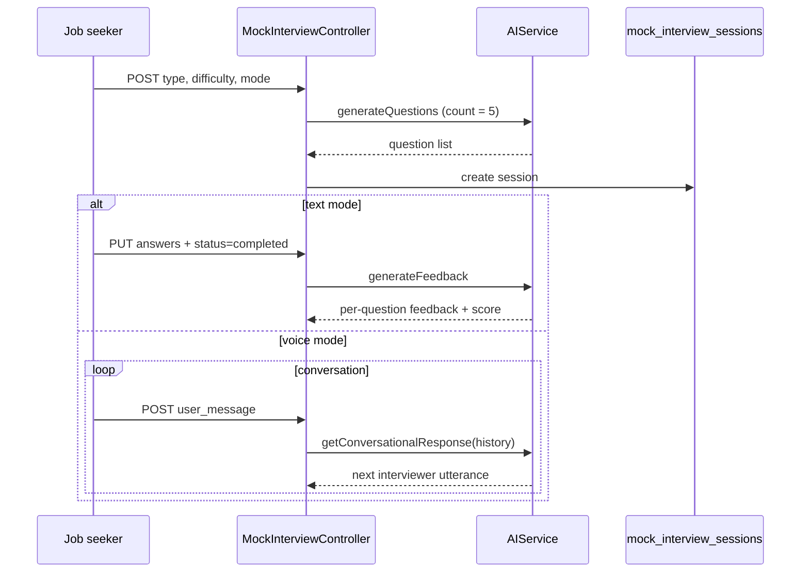

# Architecture

## Product shape

Hirely currently behaves as two products sharing one codebase:

1. **Career preparation (job seeker)** — mock interviews, portfolio, skill goals, job browsing, billing.
2. **Recruitment operations (HR / admin)** — companies, job postings, application review, user management, billing.

The intended product is a single recruitment platform where CVs are parsed, interviews are generated against a job and a candidate, answers are scored with explanations, and HR ranks or compares candidates with a human in the loop. That loop is in place; remaining gaps are hosting-provider cutover and extras such as virus scanning, SSO, and multi-role orgs.

## High-level diagram



Voice interviews talk to Laravel for conversation turns, then use the **browser** for speech-to-text and text-to-speech.

## Roles

| Role | Intended use | How it is applied today |
| --- | --- | --- |
| `job_seeker` | Candidates | Default on registration and on the `users.role` column. Sidebar shows seeker nav. |
| `hr_professional` | Recruiters | Created by admin and optionally linked to `companies`. Sidebar shows HR nav. |
| `admin` | Platform operators | Seeded and created via user management. Sidebar shows admin nav. |

Authorization is **enforced on the server**. `EnsureUserHasRole` (`role` middleware) wraps job-seeker, HR, and admin route groups. Dashboard and settings stay shared. HR job, candidate, and template queries are scoped to `company_id` when present.

## Request flow

1. Browser loads Blade `resources/views/app.blade.php`.
2. Vite serves the Vue/Inertia SPA (`resources/js/app.ts`).
3. Inertia visits hit Laravel controllers, which return page components plus props.
4. Shared props (user id, name, email, role) come from `HandleInertiaRequests`.
5. Typed routes are generated by Laravel Wayfinder.

## Application modules

```
app/
  Actions/Fortify/     Registration and password reset
  Http/Controllers/
    Admin/             Companies, users, HR, job seekers, payments
    HR/                Jobs, candidates, templates, interviews, rankings, reports, company settings
    JobSeeker/         Mock interviews, portfolio, skills, applications
    Payment/           Stripe checkout and subscriptions
    Settings/          Profile, password, 2FA
  Models/              User, Company, Job, JobApplication, MockInterviewSession, ...
  Services/
    AIService.php      OpenAI question generation, conversation, feedback
    StripeService.php  Customers, checkout sessions, subscriptions
```

Frontend pages live under `resources/js/pages/` with the same role split: `job-seeker/`, `hr/`, `admin/`, `auth/`, `settings/`.

## Interview architecture (current)



Missing compared with the product vision:

- No server-side interview audio storage
- No remaining-time-budget adaptation during interviews
- Hosting-provider TLS, backups, and live mail/S3 credentials

## Data ownership

| Entity | Owner today | Intended owner |
| --- | --- | --- |
| `job_postings` | The HR user who created it (`user_id`) | Organization, with HR as actor |
| `job_applications` | Job seeker (`user_id`) + job | Same, plus parsed CV snapshot |
| `companies` | Admin-managed, with HR self-service profile for their linked org | Tenant; HR should only see their org |
| `mock_interview_sessions` | Job seeker | Keep for practice; add a separate recruitment interview |

Job creation loads `Company::all()`, so an HR user can attach a posting to any company, not only their own.

## Frontend architecture

- Vue 3 + TypeScript + Inertia 2
- Tailwind CSS 4 and Reka UI (shadcn-vue style) in `resources/js/components/ui/`
- Role-specific sidebar in `AppSidebar.vue`
- Settings layout for profile / password / appearance / 2FA

Dashboards, CV review, ATS, profile score, reports, and analytics are wired to live queries. Treat those pages as current unless a specific control still shows a placeholder.

## Security architecture (current vs needed)

Current:

- Session cookies, CSRF, password hashing, Fortify rate limits
- Optional TOTP 2FA
- Email verification middleware on app routes
- `role` middleware on job-seeker, HR, and admin route groups
- Company-scoped HR queries, Stripe webhook signatures, interview `review_audit`

Needed:

- Finer-grained policies
- File malware scanning
- Hosting-provider secrets and backups
