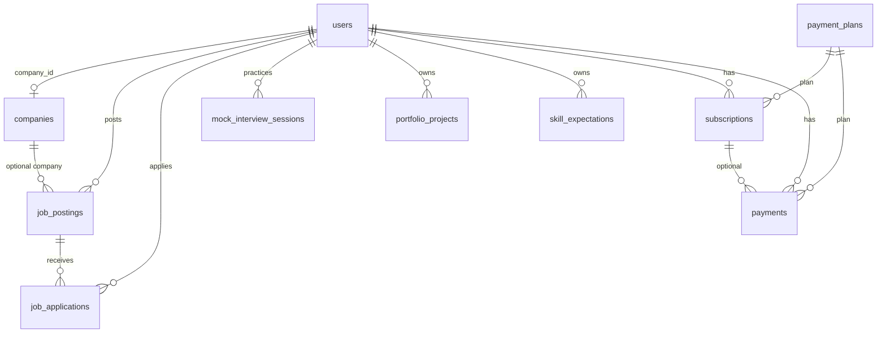

# Data model

## Entity relationship (current)

There is no table for parsed CVs, interview templates, scored answers, rankings, comparisons, in-app notifications, or human-review decisions.

## Tables

### `users`

Laravel default plus:

- `role` enum: `job_seeker` | `hr_professional` | `admin` (default `job_seeker`)
- `company_id` nullable FK
- Fortify 2FA columns
- Stripe: `stripe_customer_id`, `pm_type`, `pm_last_four`

Registration (`CreateNewUser`) does not set `role`, so public sign-up is always a job seeker.

### `companies`

Admin-managed organizations: name, slug, description, website, logo, industry, size, location, address, phone, email, `is_verified`.

### `job_postings` (model `Job`)

HR-authored vacancies: title, description, requirements, location, type (`full_time` … `internship`), remote (`on_site` | `remote` | `hybrid`), salary range/currency, JSON `skills`, status (`draft` | `active` | `closed` | `expired`), `expires_at`.

Owned by `user_id` (the posting HR user), not by a required company.

### `job_applications`

Seeker application to a posting: optional `cover_letter`, `resume_path` (string, not a real upload), status (`pending` | `reviewing` | `shortlisted` | `interviewed` | `accepted` | `rejected`), HR `notes`, `applied_at`.

### `mock_interview_sessions`

Practice interviews:

- `type`: `technical` | `behavioral` | `mixed`
- `difficulty`: `beginner` | `intermediate` | `advanced`
- `mode`: `text` | `voice`
- `status`: `pending` | `in_progress` | `completed` | `cancelled`
- JSON `questions`, `answers`, `conversation_history`, `feedback`
- `score`, `started_at`, `completed_at`, `duration_minutes`

Not linked to a job or application.

### `portfolio_projects`

Manual seeker projects: title, description, urls, JSON `technologies`, dates, image string, `is_featured`.

### `skill_expectations`

Self-reported skill goals: name, description, `current_level` / `target_level` (0–100), `target_date`, status.

### Billing

- `payment_plans` — amount, interval, Stripe ids, JSON `features`, `target_role`, `is_active`
- `subscriptions` — Stripe subscription id, status, period dates
- `payments` — amount, status, Stripe payment intent id

## Models without extra domain tables

Laravel `Notifiable` is on `User`, but there is no `notifications` usage beyond Fortify mail. No `interviews`, `cv_analyses`, `rankings`, or `audit_logs` models exist.

## Suggested model additions (not implemented)

These are the minimum new entities implied by the unimplemented product capabilities:

| Proposed table | Supports |
| --- | --- |
| `candidate_profiles` / `cv_documents` / `cv_extractions` | CV upload and structured extraction |
| `interview_templates` | Configurable question mix, duration, weights, criteria |
| `interviews` | Recruitment interview tied to application + template |
| `interview_questions` / `interview_answers` | Stored Q&A with category and weight |
| `evaluations` | Scores, strengths/weaknesses, explanations, human override |
| `rankings` | Ordered shortlist per job |
| `notifications` (database channel) | In-app notification system |
| `audit_events` | HITL decisions and score changes |
