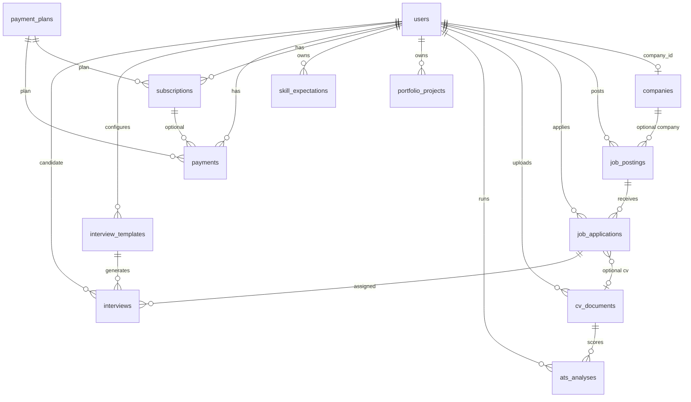

# Data model

## Entity relationship (current)

There is no table for in-app notifications. Ranking snapshots live on `job_applications` (`ranking_score`, `ranking_position`, `ranking_breakdown`, `ranked_at`). Human review of AI interview scores lives on `interviews` (`review_status`, `human_score`, `human_notes`, `review_audit`).

Recruitment interviews use `interview_templates` and `interviews` (linked to `job_applications`). Mock practice interviews remain on `mock_interview_sessions`.

## Tables

### `users`

Laravel default plus:

- `role` enum: `job_seeker` | `hr_professional` | `admin` (default `job_seeker`)
- `company_id` nullable FK
- Fortify 2FA columns
- Stripe: `stripe_customer_id`, `pm_type`, `pm_last_four`

Registration (`CreateNewUser`) does not set `role`, so public sign-up is always a job seeker.

### `companies`

Admin-managed organizations: name, slug, description, website, logo, industry, size, location, address, phone, email, `is_verified`.

### `job_postings` (model `Job`)

HR-authored vacancies: title, description, requirements, location, type (`full_time` … `internship`), remote (`on_site` | `remote` | `hybrid`), salary range/currency, JSON `skills`, status (`draft` | `active` | `closed` | `expired`), `expires_at`.

Owned by `user_id` (the posting HR user), not by a required company.

### `job_applications`

Seeker application to a posting: optional `cover_letter`, `resume_path` (string, not a real upload), status (`pending` | `reviewing` | `shortlisted` | `interviewed` | `accepted` | `rejected`), HR `notes`, `applied_at`, plus ranking snapshot columns (`ranking_score`, `ranking_position`, JSON `ranking_breakdown`, `ranked_at`).

### `mock_interview_sessions`

Practice interviews for job seekers. Not linked to a job or application.

### `interview_templates`

HR-configured recruitment interviews: question count, duration, difficulty, mode, mix percentages (technical / behavioral / scenario / CV), evaluation criteria, optional `job_id`, `company_id`.

### `interviews`

Assigned recruitment interviews: template, job application, candidate, questions/answers/feedback/score, status.

On completion the evaluator stores JSON `evaluation` (overall score, rationale, confidence, strengths, weaknesses, dimension scores with evidence, per-answer scores) and `ai_score`. Template `evaluation_criteria` are copied onto `criteria`. HR review columns: `human_score`, `human_notes`, `review_status` (`pending_review` | `accepted` | `edited` | `rejected`), `reviewed_by`, `reviewed_at`, JSON `review_audit`. Effective `score` is the AI score until an HR edit replaces it.

### `cv_documents`

Uploaded resumes: original name, private `path`/`disk`, parsed text, JSON `extraction`, JSON `review`, `review_score`, status (`pending` | `processed` | `failed`).

### `ats_analyses`

CV-to-job compatibility runs: optional `job_id`, job description, score, JSON analysis (matched/missing skills).

### `portfolio_projects`

Manual seeker projects: title, description, urls, JSON `technologies`, dates, image string, `is_featured`.

### `skill_expectations`

Self-reported skill goals: name, description, `current_level` / `target_level` (0–100), `target_date`, status.

### Billing

- `payment_plans` — amount, interval, Stripe ids, JSON `features`, JSON `limits` (numeric caps or `null` for unlimited; booleans for feature flags), `target_role`, `is_active`
- `subscriptions` — Stripe subscription id, status, period dates
- `payments` — amount, status, Stripe payment intent id

### `notifications`

Laravel database notifications (UUID id, morphs `notifiable`, JSON `data` with type/title/body/url, `read_at`).

## Models without extra domain tables

Laravel `Notifiable` is on `User`. Recruitment events write to the `notifications` table and send mail. Interview HITL audit remains JSON on `interviews`; ranking snapshots remain on `job_applications`.

## Suggested model additions (not implemented)

These are the minimum new entities implied by the unimplemented product capabilities:

| Proposed table | Supports |
| --- | --- |
| (none remaining for the 23-item core) | Remaining work is hosting-provider cutover and extras (SSO, virus scan, SMS, multi-role orgs) |
